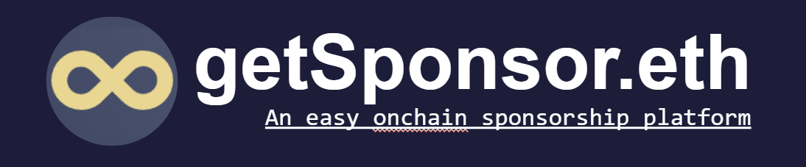

# getSponsoreth

Weolcome to getSponsoreth repository!

##### Sponsorship platforms in Web2
- Centralized
- KYC required
- High fees
- Limited by:
  - Geographic areas
  - Payment Systems
  - Currencies

##### getSponsoreth is:
- Decentralized
- No KYC
- Low fees
- Universal

##### getSponsor.eth : a Web3 based sponsorship platform:
- Users connect their wallets access the platform
- Create causes for which they need funding
- Sponsors browse causes and choose a payment method
  - Direct crypto transfer (ETH, MATIC, USDC, DAI…)
  - Staking rewards transfer
  - Fiat-to-crypto bridge

##### Within this repository you will find used technologies as:
- Figment.io for the RPC
- Transak to enable FIAT-to-crypto buy option
- STORJ IPFS to host the user’s pledge contents
- SKYNET to host the frontend assets
- The Graph to store the users’ data
- Coinbase Wallet

## Work Flow
  - User Create a Pledge
  - Sponsor can contribute to a pledge:
  
    - Direct funding: Fund directly sent to creator of pledge.
    - Staking: Funds are staked in a new contract specific for pledge then and deposited into Aave lending pool then:
    
      - aToken is minted for the specific pledge contract.
      - Staker can reclaim his funds at anytime.
      - Creator can claim the yield at anytime.
      - Accounting is handled inside the specific vault contract
      - 
## Below are links to the deployed smart contracts

### Starknet Contract
[Voyager Link](https://goerli.voyager.online/contract/0x00dc504d0dd1c97c459d62bc486658cc46d1aa51493a466f62f8ae050ccd8e43#readContract)

### Kovan Contract
[Kovan Contract](https://kovan.etherscan.io/address/0xF58a11de9Ce9a32aA6dae1630C9b4d3810C6f12C#code)

### Mumbai Contract
[Mumbai Contract](https://mumbai.polygonscan.com/address/0x36DD9D9ecF2D8805FC5939188b26aC669202b2e1#code)

### Sokol Gnosis Contract
[Gnosis Contract](https://blockscout.com/poa/sokol/address/0xC9d405431baA5304F14EA4A721f2f625e19Bee79/transactions)

### Celo  Alfajores Contract
[Celo Contract](https://alfajores-blockscout.celo-testnet.org/address/0xC9d405431baA5304F14EA4A721f2f625e19Bee79/transactions)

### Link Skynet FAQ page 
[FAQ on Skynet](https://vg7av08comgek7drmdvnckfsrre9i3q4spm58sm8038ajn5kkp38gug.siasky.net/)

